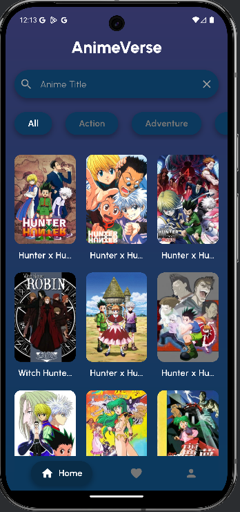
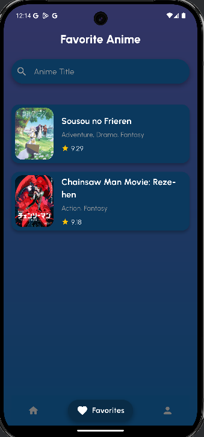
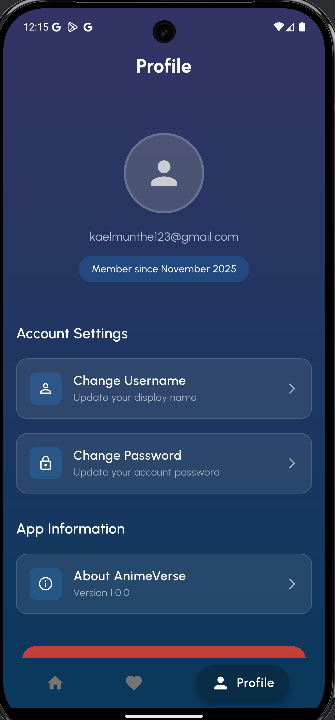

📱 Anime Verse – Flutter Mobile App
👤 Identitas Mahasiswa
Keterangan	Detail
Nama	Michael Valent Satrio Munthe
NIM	231401103
Program Studi	Ilmu Komputer – Universitas Sumatera Utara
Mata Kuliah	Lab Pemrograman Mobile
Dosen Pembina	(isi nama dosen)
📘 Project Description

Anime Verse adalah aplikasi Flutter sederhana yang menampilkan daftar anime populer dan detail informasinya.
Aplikasi ini dibuat sebagai latihan pemrograman mobile dengan fokus pada:

✨ Fitur Utama

🏷️ List Anime

📄 Detail Anime

🎨 UI berbasis Flutter Widgets

🔄 Navigasi antar halaman

🌐 (Opsional) Fetch data API anime

Project ini bertujuan untuk melatih kemampuan mahasiswa dalam:

Struktur dasar proyek Flutter

Penggunaan widget dan state

Membuat UI responsif di Android

Navigasi dan manajemen antar halaman

🖼️ Screenshots Aplikasi

🎬 Link Demo Aplikasi

👉 Demo Aplikasi:
https://drive.google.com/file/d/13eOcBDDcfWFcQ0RSDx47Fl3Dz5BbXDra/view?usp=sharing

📂 Repository Link

Repositori project ini:
🔗 https://github.com/michaelmunthe123/labpemmob.git

🛠️ Tech Stack

Flutter

Dart

Android Studio